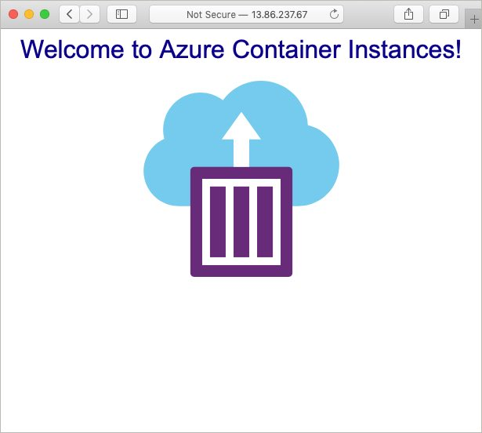

# String Interpolation

## Module Overview

Terraform string interpolation allows you to consume varriables, resource attributes, and data from other data sources within your Terraform configurations.

In this module, you will work with string interpolation. You will also be introduced to the `terraform plan` command.

## Update configuration to include a Container Instance resource

Open the previously created configuration found in the `main.tf` file. The contents should match the following. If needed, recreate the file.

```
resource "azurerm_resource_group" "hello-world" {
  name     = "hello-world"
  location = "eastus"
}
```

We now want to add an Azure Container Instance to the configuration. When doing so, we have two challenges.

a. The container instance must have a globally unique fully qualified domain name.

b. The container instance needs to be created inside of the resource group that is also defined in the configuration.

Replace the contentes of **main.tf** with the following configuration.

```
resource "azurerm_resource_group" "hello-world" {
  name     = "hello-world"
  location = "eastus"
}

resource "random_integer" "ri" {
  min = 10000
  max = 99999
}

resource "azurerm_container_group" "hello-world" {
  name                = "hello-world"
  location            = "${azurerm_resource_group.hello-world.location}"
  resource_group_name = "${azurerm_resource_group.hello-world.name}"
  ip_address_type     = "public"
  dns_name_label      = "${azurerm_resource_group.hello-world.name}-${random_integer.ri.result}"
  os_type             = "linux"

  container {
    name   = "hello-world"
    image  = "microsoft/aci-helloworld"
    cpu    = "0.5"
    memory = "1.5"
    ports {
      port      = 80
      protocol  = "TCP"
    }
  }
}
```

To solve a, you can use a second Terraform provider named random to generate a random string that can be appended to a base FQDN name. This can be seen around line 6 in the below configuration.

To solve b, you can use consume the name from the **azure_resource_group** resource, and interpolate the value in the container instance configuration.

Looking at the **azure_container_group** resource, you will see both the random integer `${random_integer.ri.result}` and the resource group `${azurerm_resource_group.hello-world.name}` name being used in the configuration.

## Apply the configuration

Run `terraform init` to ensure the directory is initialized.

```
terraform init
```

This time instead of running `terraform apply` to run the configuration, use `terraform plan --out plan.out` to visualize what will be created and produce a plan file.

```
terraform plan --out plan.out
```

Use `terraform apply plan.out` to apply the plan.

```
terraform apply plan.out
```

You can validate that the container has been created using the Azure CLI `az contaier list` command.

```
az container list -o table

Name         ResourceGroup    Status     Image                     IP:ports          Network    CPU/Memory       OsType    Location
-----------  ---------------  ---------  ------------------------  ----------------  ---------  ---------------  --------  ----------
hello-world  hello-world      Succeeded  microsoft/aci-helloworld  52.191.236.89:80  Public     0.5 core/1.5 gb  Linux     eastus
```

The containers public IP address can be used to see the running application.



## Next Module

In the next module, you will learn about adding both input and output variables to a Terraform configuration.

Module 4: [Terraform Variables](../04-terraform-variables)