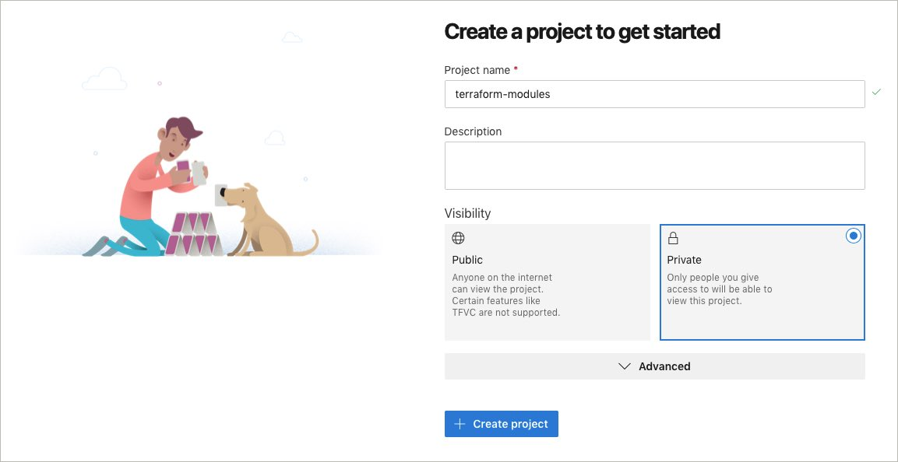
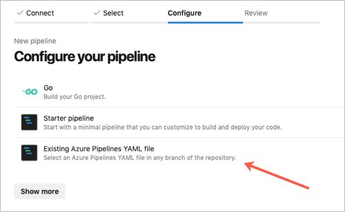
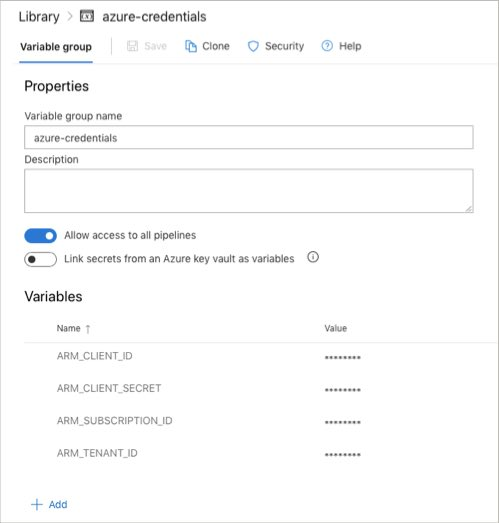
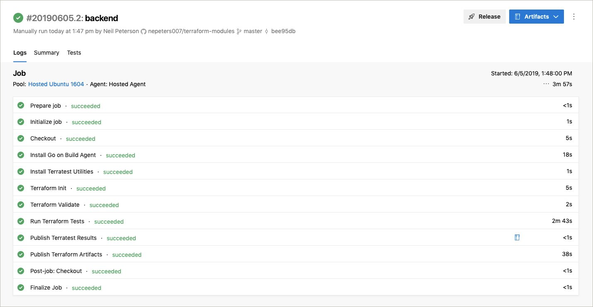

# Automating tests and builds with Azure Pipelines

## Module Overview

In this module, you will package up many of the concepts learned throughout the workshop into an automated build pipeline. The content in this module assumes that you have been working along with the workshop and have allready forked [this repo](https://github.com/neilpeterson/terraform-modules.git).

## Create an Azure DevOps instance

If needed, create an Azure DevOps instance. Azure DevOps is free for open source projects, including this workshop.

Navigate to [https://azure.microsoft.com/en-ca/services/devops](https://azure.microsoft.com/en-ca/services/devops/?WT.mc_id=cloudnativeterraform-github-nepeters) and sign up for a free Azure DevOps organization.


Once you have created the organization, you may be prompted to create a new project.



## Create Build Pipeline

*Pipelines* > *Build* > *New Pipeline* > *GitHub (YAML)*


Select the GitHub repository that contains the Terraform configurations. You may be prompted to approve the repository connection.


An Azure build pipeline YAML file has been pre-created in the repository. Select *Existing Azure Pipelines YAML file*.



The pipeline file is named *build-pipeline.yaml*. Enter this value for the path.


At this point, the pipeline should have been imported.


Click the **Run** button to kick off the initial build.

....unfortunately, the build will fail.

## Add Azure Credentials

In order for you to run Terratest integration tests, you will need to provide credentials to the pipeline.

First, use the Azure CLI [az ad sp create-for-rbac](https://docs.microsoft.com/en-us/cli/azure/ad/sp?WT.mc_id=cloudnativeterraform-github-nepeters#az-ad-sp-create-for-rbac) command to create an Azure Service Principal.

```
$ az ad sp create-for-rbac

{
  "appId": "3026b3e5-000-000-0000-3497c48fbee1",
  "displayName": "azure-cli-2019-06-05-06-16-20",
  "name": "http://azure-cli-2019-06-05-06-16-20",
  "password": "48005028-0000-0000-0000-f6063e5e3a1f",
  "tenant": "72f988bf-0000-0000-0000-2d7cd011db47"
}
```

Use the [az account list](https://docs.microsoft.com/en-us/cli/azure/account?WT.mc_id=cloudnativeterraform-github-nepeters#az-account-list) command to find the Azure subscription id.

```
$ az account list -o table

Name                                         CloudName    SubscriptionId                        State    IsDefault
-------------------------------------------  -----------  ------------------------------------  -------  -----------
ca-nepeters-demo-test                        AzureCloud   3000087c-0000-0000-0000-29e5e0000daf  Enabled  True
```

Back in the Azure Pipeline, click **Library** > **Variable Groups**.

Create a variable group named `azure-credentials` and add the following variables, encrypting each one with the lock button.

- **ARM_CLIENT_ID**: The service principal appId.
- **ARM_CLIENT_SECRET**: The service principal password.
- **ARM_TENANT_ID**: The tenant id which can be found with the service principal information.
- **ARM_SUBSCRIPTION_ID**: The Azure subscription id.



Click on the **Save**, navigate back to the pipeline, and click the **queue** button to start a new build. Select the build to see the progress.


Once completed, assuming everything went well, you should see all tasks as successful.



## Next Module

In the next module, you will learn about deploying Terraform configurations with Azure Release pipelines.

Module 11: [Continuous Deployment](../11-continuous-deployment)