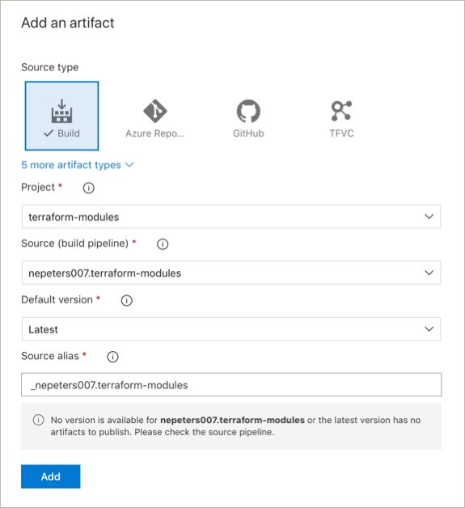

# Integrating with Azure Pipelines

## Create configuration repository

Create a repository of Terraform configurations. For this example, we will fork the workshop repo. Navigate to [https://github.com/neilpeterson/terraform-modules.git](https://github.com/neilpeterson/terraform-modules.git) and fork the repo.

Clone the repo into your cloud shell instance. Update the URL with the address of your fork.

```
git clone https://github.com/<replace>/terraform-devops-sample.git
```

## Create an Azure DevOps instance

If needed, create an Azure DevOps instance. Azure DevOps is free for open source projects, including this workshop.

Navigate to [https://azure.microsoft.com/en-ca/services/devops/](https://azure.microsoft.com/en-ca/services/devops/?WT.mc_id=cloudnativeterraform-github-nepeters) and sign up for a free Azure DevOps organization.


Once you have created the organization, a DevOps project is automatically created for you. The DevOps project is where you can create and manage Azure Boards, Azure Repositories, and Azure Pipelines. We will come back to the organization and work with Pipelines later in this module.

## Create Build Pipeline

Pipelines > Build > New Pipeline > GitHub (YAML)

Select the GitHub repository that contains the Terraform configurations

Approve and install the Azure Pipelines > GitHub integration

Existing Azure Pipelines YAML file

Path > pipeline.yaml

## Create Release Pipeline

Create a new release pipeline. YAML based release pipelines are in preview and do not yet support manual approvals, so we will work with classic pipelines for this workshop.

**Pipelines** > **Release** > **New Pipeline**

Start with an empty job pipeline template.


Name the first stage `Test (Resource Group)`. We will add a production stage later in this module.


Add the deployment artifacts created during the build.

Select **Artifacts** > **Add** > **Build** > **terraform-modules-CI** > **Add**



Select the stage to edit the stage tasks.

Select the parent task named `Agent job` and update the Agent pool to use `Hosted Ubuntu 1604` as the operating system for the build agent.


Add a `Command Line` task, give it a name of `Terraform Init`, and copy in the following commands:

```
cd _terraform-modules-CI/drop/modules/hello-world
terraform init
```

Add a `Command Line` task, give it a name of `Terraform Plan`, and copy in the following commands:

```
cd _terraform-modules-CI/drop/modules/hello-world
terraform plan --out plan.out
```

Add a `Command Line` task, give it a name of `Terraform Apply`, and copy in the following commands:

```
cd _terraform-modules-CI/drop/modules/hello-world
terraform plan --out plan.out --var resource_group=hello-world-test-$(Build.BuildId)
```

The last step is to configure credentials that have access to create Azure resources. For this step, we will create an Azure service principal and store the values in encrypted Azure DevOps variables.

## Next Module

In the next module, you will learn about deploying Terraform with Cloud Native Application Bundles.

Module 10: [Terraform and CNAB](../11-terraform-cnab)