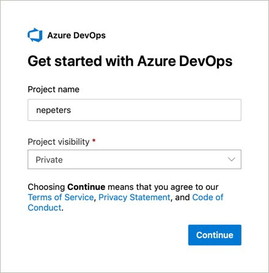
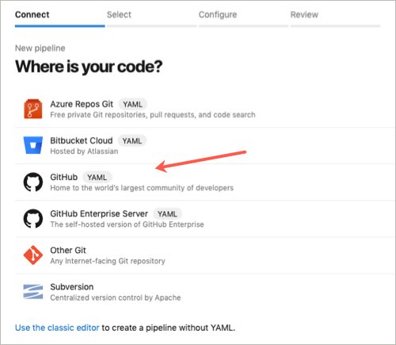
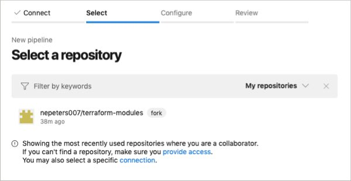
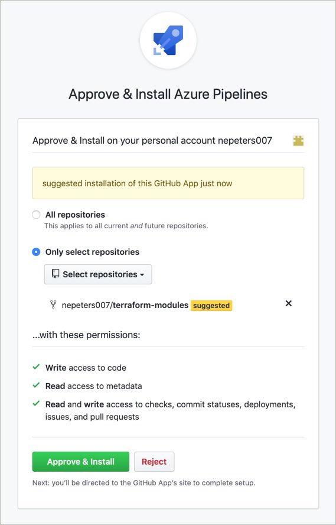
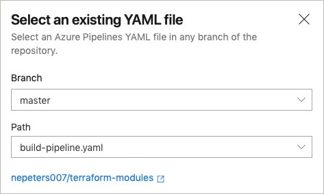
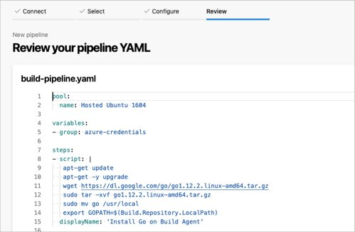
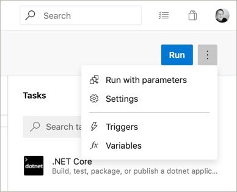
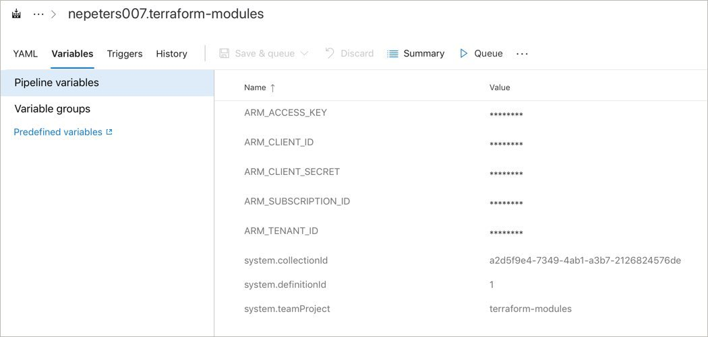

# Integrating with Azure Pipelines

## Module Overview

## Create configuration repository

Create a repository of Terraform modules.

Navigate to [https://github.com/neilpeterson/terraform-modules.git](https://github.com/neilpeterson/terraform-modules.git) and fork the repo.

## Create an Azure DevOps instance

If needed, create an Azure DevOps instance. Azure DevOps is free for open source projects, including this workshop.

Navigate to [https://azure.microsoft.com/en-ca/services/devops](https://azure.microsoft.com/en-ca/services/devops/?WT.mc_id=cloudnativeterraform-github-nepeters) and sign up for a free Azure DevOps organization.



Once you have created the organization, you will be prompted to create a new project.


## Create Build Pipeline

Create a new build pipeline.

*Pipelines* > *Build* > *New Pipeline* > *GitHub (YAML)*



Select the GitHub repository that contains the Terraform configurations



Approve and install the Azure Pipelines > GitHub integration



If you have forked the sample repo, an Azure Pipeline YAML file has been pre-created in the repository. Select *Existing Azure Pipelines YAML file*.


The pipeline file is named *build-pipeline.yaml*. Enter this value for the path.



At this point, the pipeline should have been imported.



Click the **Run** button to kick off the initial build.

....unfortunately, the build will fail.

## Add Azure Credentials

In order for you to run terratest integration test, you will need to provide credentials to the pipeline.

**Service Principal**

First, use the Azure CLI [az ad sp create-for-rback](https://docs.microsoft.com/en-us/cli/azure/ad/sp?WT.mc_id=cloudnativeterraform-github-nepeters#az-ad-sp-create-for-rbac) command to create an Azure Service Principal. Take note of each value, these will be added to the pipeline.

```
$ az ad sp create-for-rbac

{
  "appId": "3026b3e5-000-000-0000-3497c48fbee1",
  "displayName": "azure-cli-2019-06-05-06-16-20",
  "name": "http://azure-cli-2019-06-05-06-16-20",
  "password": "48005028-0000-0000-0000-f6063e5e3a1f",
  "tenant": "72f988bf-0000-0000-0000-2d7cd011db47"
}
```

**Azure Subscription ID**

You will also need your Azure subscription id. Use the [az account list](https://docs.microsoft.com/en-us/cli/azure/account?WT.mc_id=cloudnativeterraform-github-nepeters#az-account-list) command to find this value.

```
$ az account list -o table

Name                                         CloudName    SubscriptionId                        State    IsDefault
-------------------------------------------  -----------  ------------------------------------  -------  -----------
ca-nepeters-demo-test                        AzureCloud   3000087c-0000-0000-0000-29e5e0000daf  Enabled  True
```

**Storage Account Key**

You will also need to gather the storage account key for the terraform state backend. This can be found in the Azure portal, or by using the [az storage account keys list]() command

```
$ az storage account keys list --resource-group nepeters-terraform-state --account-name nepetersterraformstate -o table

KeyName    Permissions    Value
---------  -------------  ----------------------------------------------------------------------------------------
key1       Full           00000000000000000000000000000000000000000000000000000000000000000000000000000000000000==
key2       Full           00000000000000000000000000000000000000000000000000000000000000000000000000000000000000==

```

**Configure Variables**

Back in the Azure Pipeline, click *Builds* > *Edit*. Click on the ellipsis near the top left hand and click *Variables*.



Add the following variables, encrypting each one with the lock button.

- **ARM_ACCESS_KEY**: Storage account key for the state backend.
- **ARM_CLIENT_ID**: The service principal appId.
- **RM_CLIENT_SECRET**: The service principal password.
- **ARM_TENANT_ID**: The tenant id which can be found with the service principal information.
- **ARM_SUBSCRIPTION_ID**: The Azure subscription id.



## Create Release Pipeline

Create a new release pipeline. YAML based release pipelines are in preview and do not yet support manual approvals, so we will work with classic pipelines for this workshop.

**Pipelines** > **Release** > **New Pipeline**

Start with an empty job pipeline template.


Name the first stage `Test (Resource Group)`. We will add a production stage later in this module.


Add the deployment artifacts created during the build.

Select **Artifacts** > **Add** > **Build** > **terraform-modules-CI** > **Add**


Select the stage to edit the stage tasks.

Select the parent task named `Agent job` and update the Agent pool to use `Hosted Ubuntu 1604` as the operating system for the build agent.


Add a `Command Line` task, give it a name of `Terraform Init`, and copy in the following commands:

```
cd _terraform-modules-CI/drop/modules/hello-world
terraform init
```

Add a `Command Line` task, give it a name of `Terraform Plan`, and copy in the following commands:

```
cd _terraform-modules-CI/drop/modules/hello-world
terraform plan --out plan.out
```

Add a `Command Line` task, give it a name of `Terraform Apply`, and copy in the following commands:

```
cd _terraform-modules-CI/drop/modules/hello-world
terraform plan --out plan.out --var resource_group=hello-world-test-$(Build.BuildId)
```

The last step is to configure credentials that have access to create Azure resources. For this step, we will create an Azure service principal and store the values in encrypted Azure DevOps variables.

Now run the pipeline again, this time eeverything should work.

## Next Module

In the next module, you will learn about deploying Terraform with Cloud Native Application Bundles.

Module 10: [Terraform and CNAB](../11-terraform-cnab)